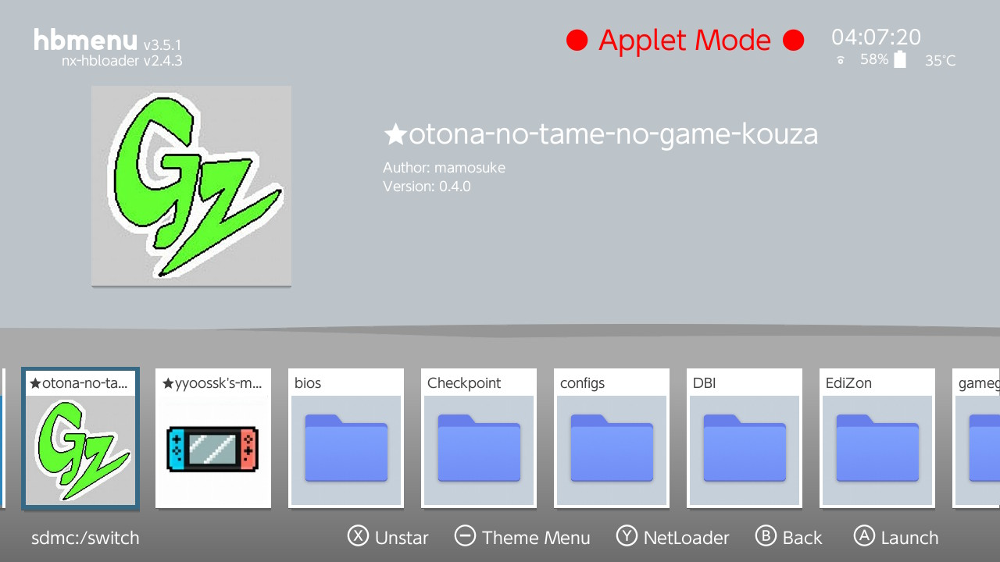
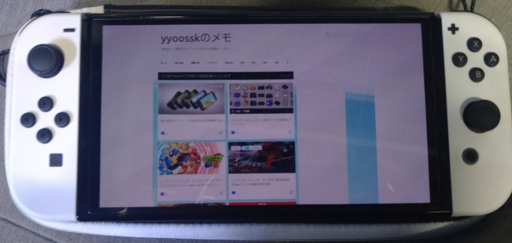
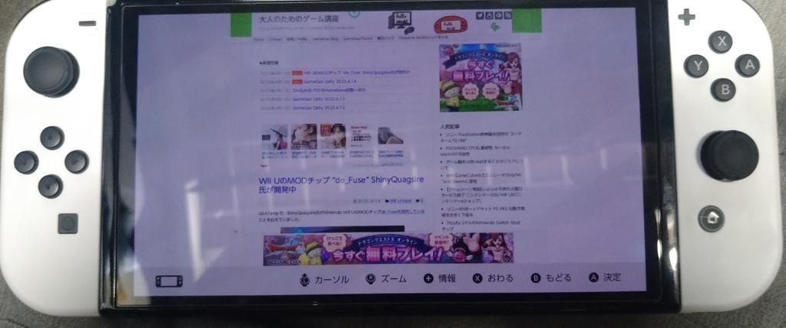

=====

## 内容
- yyoosskのメモ(ホーム画面バージョン)
- yyoosskのメモ(ニンテンドースイッチニュース)
- 大人のためのゲーム講座

## ダウンロード
https://github.com/yyoossk/Atmosphere-with-Hekate/releases

## 使用方法
入れたいものをダウンロード＆解凍し、switchフォルダをsdカードのルートに上書きコピーし、hbmより起動
又は、上記を導入した上で、ホーム画面から直接起動できるフォーワーダーのnspをインストール

これはインターネットブラウザを起動できるBrowseNXのソースコードの本の一部を弄ってコンパイルしたものです 
https://yyoossk.blogspot.com/2019/01/browsenx.html 
https://github.com/crc-32/BrowseNX 
crc-32氏が作成したもので、自分がそれを少し弄っただけのものです 

## クレジット
Thanks to  
crc-32 
mamosuke 

## コンタクト
https://twitter.com/Cloud0835

## 自分のブログ
https://yyoossk.blogspot.com/search/label/
