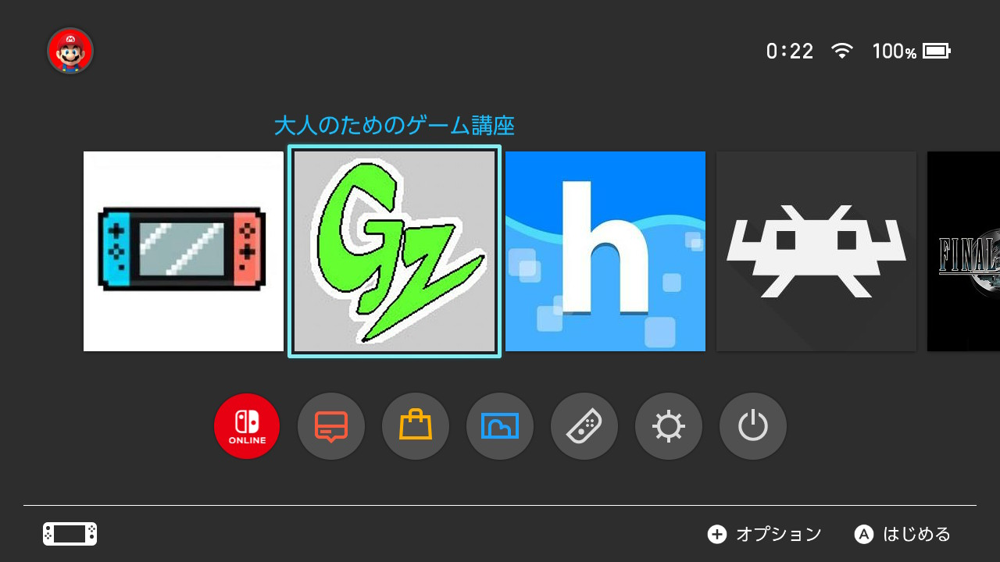

## 概要
これはインターネットブラウザを起動できるBrowseNXのソースコードのほんの一部を弄ってコンパイルしたものです 
https://yyoossk.blogspot.com/2019/01/browsenx.html 
https://github.com/crc-32/BrowseNX 
crc-32氏が作成したもので、自分がそれを少し弄っただけなので特別新しいものではありません 

## 内容
- 大人のためのゲーム講座　otona-no-tame-no-game-kouza
- yyoosskのメモ(更新順)　yyoossk's-memo-news
- yyoosskのメモ(ニンテンドースイッチニュース)  yyoossk's-memo-switch-news
- yyoosskのメモ(ブログアーカイブ)　yyoossk's-memo-blogarcive

## ダウンロード
https://github.com/yyoossk/blog-browser/releases

## 使用方法
入れたいものをダウンロード＆解凍し、switchフォルダをsdカードのルートに上書きコピーし、hbmより起動
又は、上記を導入した上で、ホーム画面から直接起動できるフォーワーダーのnspをインストール

## クレジット
Thanks to  
crc-32 
mamosuke 

## コンタクト
追加してほしいブログなどがあれば言ってください 
https://twitter.com/Cloud0835

## 自分のブログ
https://yyoossk.blogspot.com/2023/04/switch-blog-browser.html 
https://yyoossk.blogspot.com/search/label/

